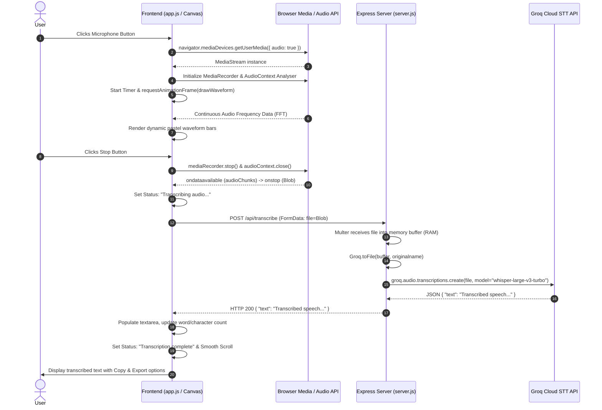

# Voice Transcription Application — System Specification Sheet

A full-stack, real-time voice capture and speech-to-text transcription web application powered by **Groq's Whisper Large v3 Turbo** model and built with a lightweight, zero-build Node.js/Express and Vanilla JavaScript architecture.

---

## 1. Executive Summary & System Overview

The **Voice Transcription** app provides an in-browser audio recording and automated transcription experience. Users can start a voice recording with one click, view a real-time pastel audio visualizer powered by the Web Audio API, and automatically transmit the captured audio to an Express backend upon stopping. The server processes the audio stream in-memory and sends it directly to Groq's high-speed Whisper Large v3 Turbo transcription endpoint, returning the transcribed text in seconds.

### Key Highlights
- **Sub-Second to Low-Latency Transcription**: Powered by Groq's LPU-accelerated `whisper-large-v3-turbo`.
- **Zero Disk I/O Ingestion**: Audio blobs are held and passed strictly in memory (RAM) via `multer.memoryStorage()` and `Groq.toFile()`.
- **Real-Time Visual Feedback**: Live Web Audio API FFT frequency visualizer rendered on an HTML5 `<canvas>`.
- **Cross-Browser Audio Compatibility**: Dynamic MIME type negotiation (`audio/webm;codecs=opus`, `audio/webm`, `audio/ogg;codecs=opus`, `audio/mp4`).
- **Client-Side Productivity Tools**: Live word & character counters, one-click clipboard copying, `.txt` file export, and editable transcription text area.
- **Pastel Design System**: Custom tokenized CSS with soft glow drift animations, micro-interactions, and accessible typography.

---

## 2. Technology Stack

| Layer | Technology | Version / Spec | Purpose / Description |
| :--- | :--- | :--- | :--- |
| **Frontend UI** | HTML5 Semantic Markup | HTML5 | Application layout, accessible buttons, icons, canvas visualizer |
| **Frontend Styling** | Vanilla CSS3 | Modern CSS Variables | Pastel color tokens, glassmorphism cards, pulsating keyframe animations |
| **Frontend Scripting**| Vanilla JavaScript | ES6+ Modules | MediaRecorder API, Web Audio API, dynamic UI updates, API client |
| **Client Audio APIs** | `MediaStream` / `MediaRecorder` / `AudioContext` | W3C Standard | Microphone stream acquisition, dynamic MIME sniffing, FFT spectrum analysis |
| **Backend Runtime** | Node.js | `>= 18.x` | Server-side JavaScript runtime |
| **Web Framework** | Express.js | `^5.2.1` | REST API routing and static asset delivery |
| **Multipart Parsing** | Multer | `^2.1.1` | In-memory multipart/form-data upload parsing (25 MB max buffer) |
| **AI / STT Provider** | Groq Cloud SDK | `^1.1.2` | High-speed client for Groq's Speech-to-Text API |
| **Speech Model** | `whisper-large-v3-turbo` | OpenAI Whisper on Groq LPU | Ultra-fast, multilingual/English speech recognition engine |
| **Environment Mgmt** | `dotenv` | `^17.4.1` | Environment variable loader (`.env`) |
| **Dev Tooling** | `nodemon` | `^3.1.14` | Hot-reloading server utility for local development |

---

## 3. System Architecture & Component Diagram

```
+-----------------------------------------------------------------------------------+
|                                 WEB BROWSER (CLIENT)                              |
|                                                                                   |
|  +---------------------+      +---------------------+      +-------------------+  |
|  |   Navigator Media   | ---> |    MediaRecorder    | ---> | Audio Blob Chunks |  |
|  |  (getUserMedia API) |      | (MIME Negotiation)  |      |   (Memory)        |  |
|  +----------+----------+      +---------------------+      +---------+---------+  |
|             |                                                        |            |
|             v                                                        |            |
|  +---------------------+      +---------------------+                v            |
|  |  Web Audio Context  | ---> |   HTML5 Canvas 2D   |      +-------------------+  |
|  |  (AnalyserNode FFT) |      |   (Waveform Bars)   |      |  FormData Payload |  |
|  +---------------------+      +---------------------+      | (POST /api/...)   |  |
|                                                            +---------+---------+  |
+----------------------------------------------------------------------|------------+
                                                                       | HTTP POST
                                                                       | multipart/form-data
                                                                       v
+-----------------------------------------------------------------------------------+
|                            EXPRESS SERVER (NODE.JS)                               |
|                                                                                   |
|   +---------------------------------------------------------------------------+   |
|   | express.static(__dirname) -> Serves index.html, styles.css, app.js        |   |
|   +---------------------------------------------------------------------------+   |
|   | POST /api/transcribe                                                      |   |
|   |   ├── Multer In-Memory Storage -> req.file.buffer                         |   |
|   |   └── Groq.toFile(buffer, filename) -> In-Memory File Object              |   |
|   +-------------------------------------+-------------------------------------+   |
+-----------------------------------------|-----------------------------------------+
                                          | HTTPS API Request
                                          | (whisper-large-v3-turbo)
                                          v
+-----------------------------------------------------------------------------------+
|                                GROQ CLOUD LPU INFERENCE                           |
|                                                                                   |
|   +---------------------------------------------------------------------------+   |
|   | groq.audio.transcriptions.create({ file, model, language: 'en' })         |   |
|   +---------------------------------------------------------------------------+   |
+-----------------------------------------------------------------------------------+
```

---

## 4. End-to-End Transcription Workflow (Step-by-Step)

The following sequence details the lifecycle from user interaction to completed text rendering:



### Phase-by-Phase Breakdown

#### Phase 1: Microphone Stream Acquisition & MediaRecorder Initialization
1. **User Action**: The user clicks the central microphone button `#mic-btn`.
2. **Permission Request**: `navigator.mediaDevices.getUserMedia({ audio: true })` prompts the browser for microphone hardware access.
3. **Format Sniffing**: `getSupportedMimeType()` evaluates `MediaRecorder.isTypeSupported()` to pick the highest quality supported codec:
   - `audio/webm;codecs=opus` (Modern Chrome / Firefox / Edge)
   - `audio/webm` (Fallback WebM)
   - `audio/ogg;codecs=opus` (Firefox fallback)
   - `audio/mp4` (Safari / iOS WebKit)
4. **Buffer Container**: An empty array `audioChunks = []` is initialized.
5. **Recording Event Listeners**:
   - `mediaRecorder.ondataavailable`: Pushes incoming byte chunks (`e.data`) to `audioChunks`.
   - `mediaRecorder.onstop`: Merges `audioChunks` into a single `Blob` of type `mediaRecorder.mimeType`, triggers `handleRecordingComplete(audioBlob)`, and terminates active microphone tracks.

#### Phase 2: Live FFT Analysis & Canvas Rendering
1. An `AudioContext` is instantiated.
2. A `MediaStreamAudioSourceNode` is connected to an `AnalyserNode` with `fftSize = 256` (producing 128 frequency bins).
3. The visualizer loop uses `requestAnimationFrame(drawWaveform)`:
   - Queries `analyser.getByteFrequencyData(dataArray)`.
   - Divides frequencies across 40 rendered vertical bars.
   - Dynamically calculates rounded rectangle heights and renders crisp monochromatic bars with dynamic opacity (`rgba(240, 242, 245, alpha)`) matching the minimalist dark design system.
4. A timer interval updates `#timer` every 200ms in `M:SS` format.

#### Phase 3: Stop Action & Client-Side Packaging
1. The user clicks the stop button.
2. `stopRecording()` executes:
   - Halts `mediaRecorder`.
   - Cancels the animation frame and closes `AudioContext`.
   - Flips UI state classes and stops the timer.
3. `mediaRecorder.onstop` aggregates chunks:
   ```javascript
   const audioBlob = new Blob(audioChunks, { type: mediaRecorder.mimeType });
   ```
4. `handleRecordingComplete(audioBlob)` inspects the MIME type to assign the correct extension (`.webm`, `.ogg`, or `.mp4`), bundles it into a `FormData` object with key `'file'`, and dispatches a `POST` request to `/api/transcribe`.

#### Phase 4: Server In-Memory Processing & Groq Whisper API Call
1. **Request Intake**: Express receives the multipart payload.
2. **Multer Parsing**: `upload.single('file')` places the file into `req.file.buffer` within RAM. No temporary files are written to the host filesystem.
3. **Groq File Conversion**: `await Groq.toFile(req.file.buffer, req.file.originalname)` packages the Node buffer into a standard File representation accepted by the Groq SDK.
4. **Inference Execution**:
   ```javascript
   const transcription = await groq.audio.transcriptions.create({
     file: file,
     model: 'whisper-large-v3-turbo',
     response_format: 'json',
     language: 'en',
   });
   ```
5. **Output**: Express returns `{ text: transcription.text }` with HTTP 200.

#### Phase 5: Response Parsing & Text Rendering
1. The client parses the JSON response.
2. The transcript text is injected into `#transcript-text`.
3. `#word-count` and `#char-count` are recalculated via regex split (`\s+`).
4. The transcript card is scrolled into view smoothly.
5. The status badge is updated to `"Transcription complete"`.

---

## 5. Backend Architecture & API Specifications

### 5.1 Static Asset Serving
```javascript
app.use(express.static(__dirname));
```
Allows the Express server to serve `index.html`, `styles.css`, `app.js`, and associated assets directly on the root path without an external reverse proxy during development.

### 5.2 Multer Configuration
```javascript
const upload = multer({ 
  storage: multer.memoryStorage(),
  limits: { fileSize: 25 * 1024 * 1024 } // 25 MB max file size
});
```
- **Storage Driver**: `memoryStorage()` stores binary audio files as `Buffer` objects in Node.js heap memory.
- **Safety Ceiling**: Capped at 25MB, matching Groq's maximum file payload limit and protecting the server from memory exhaustion.

### 5.3 REST Endpoint: `POST /api/transcribe`

#### Request
- **URL**: `/api/transcribe`
- **Method**: `POST`
- **Content-Type**: `multipart/form-data`
- **Body**:
  - `file` *(Binary Audio Blob, Required)*: WebM, OGG, MP4, WAV, or MP3 audio file.

#### Response Matrix

| Status Code | Condition | Response Payload |
| :--- | :--- | :--- |
| **`200 OK`** | Successful transcription | `{"text": "Transcribed text contents here..."}` |
| **`400 Bad Request`** | No file uploaded in `file` field | `{"error": "No audio file uploaded."}` |
| **`500 Internal Server Error`** | Groq API error, invalid API key, or network issue | `{"error": "Failed to transcribe audio"}` |

---

## 6. Frontend Subsystems & UI/UX Features

### 6.1 State Machine
The client UI operates across 4 distinct states:

```
    +-------------------------------------------------------+
    |                                                       |
    v                                                       |
 [ READY ] --(Click Mic)--> [ RECORDING ] --(Click Stop)--> [ PROCESSING ]
                                                                 |
                                 +-------------------------------+
                                 |
                                 v
                             [ DONE ] or [ ERROR ]
```

1. **`READY`**: Status dot is neutral gray; mic icon displayed; waveform and timer hidden.
2. **`RECORDING`**: Status dot glows red; pulsing rings animate around mic; timer increments; waveform canvas actively renders audio levels.
3. **`PROCESSING`**: Status dot glows yellow/amber; status displays `"Transcribing audio..."`; controls disabled.
4. **`DONE`**: Status dot glows green; transcript container populated; metrics updated.
5. **`ERROR`**: Status dot glows red; error toast alert displayed.

### 6.2 Productivity & Utility Features
- **Word & Character Metrics**: Live event listener on `#transcript-text` recalculates word count (`text.split(/\s+/).length`) and character count (`text.length`) on edit.
- **Clipboard Copy with Fallback**: Uses `navigator.clipboard.writeText()` when available; gracefully falls back to `document.execCommand('copy')` on older browsers or insecure contexts.
- **Text File Export**: Synthesizes a `text/plain` `Blob` client-side, generates a temporary object URL (`URL.createObjectURL`), and triggers an automated download named `transcript-YYYY-MM-DD-HH-MM-SS.txt`.
- **Clear Action**: Resets the text area, updates word counters, and reverts status to `Ready to record`.
- **Animated Toast System**: Non-blocking toast notifications with CSS slide-in/out transitions for copy and export confirmations.

---

## 7. Architectural Decisions & Rationale

| Architectural Decision | Chosen Approach | Alternative Considered | Rationale / Benefits |
| :--- | :--- | :--- | :--- |
| **Storage Architecture** | In-Memory (`multer.memoryStorage()`) | Disk Spooling (`diskStorage()`) | Eliminates disk I/O latency, eliminates temporary file cleanup routines, prevents disk filling up with orphan audio recordings. |
| **STT Model Selection** | `whisper-large-v3-turbo` on Groq LPU | Standard `whisper-large-v3` or OpenAI API | Groq's LPU architecture delivers ~10x-20x faster inference speed at low cost without sacrificing transcription accuracy. |
| **Frontend Framework** | Vanilla JS / CSS3 (No Build) | React, Next.js, Vue | Zero build step (`npm run build` not required), instantaneous startup, zero bundle size overhead, straightforward maintenance. |
| **Audio Visualization** | Web Audio API + HTML5 Canvas | Third-party visualizer library (Wavesurfer.js) | Native browser API offers zero dependencies, custom monochromatic minimalist styling, and low CPU/memory footprint. |
| **Audio Ingestion Method**| Single Blob POST on Stop | WebSocket Chunk Streaming | Batch transcription on complete phrases produces superior Whisper sentence-level contextual accuracy compared to micro-chunking. |

---

## 8. Security & Environment Configuration

### Environment Variables (`.env`)
```env
PORT=5000
HOST=0.0.0.0
GROQ_API_KEY=gsk_your_groq_api_key_here
```

### Security Considerations
1. **API Key Isolation**: `GROQ_API_KEY` is strictly managed server-side and never exposed to client-side bundles or headers.
2. **Payload Size Guardrails**: Multer enforces a 25MB ceiling to prevent buffer overflow or DoS attacks via excessively large multipart uploads.
3. **Microphone Permissions**: Handled securely via the browser's native permission model over HTTPS / localhost.

---

## 9. Developer Setup & Verification Guide

### Prerequisites
- Node.js version 18.0.0 or higher
- Valid Groq API Key ([Groq Console](https://console.groq.com/))

### Installation & Run Steps
```bash
# 1. Install dependencies
npm install

# 2. Configure environment
echo GROQ_API_KEY=your_key_here > .env

# 3. Start server with hot-reloading
npm run dev

# 4. Open in browser
http://localhost:5000
```

### Verification Checklist
- [x] Mic button triggers browser permission request.
- [x] Waveform canvas displays dynamic lilac/lavender frequency bars when speaking.
- [x] Timer increments accurately during recording.
- [x] Stop action submits audio payload to `/api/transcribe`.
- [x] Groq Whisper model returns accurate text transcription.
- [x] Word count and character count update dynamically.
- [x] "Copy" button copies transcript to system clipboard and triggers toast.
- [x] "Export" button triggers `.txt` file download with formatted timestamp.
